# 📊 Informe Ejecutivo: Análisis de Campañas de Marketing Digital

## 🔎 1. Contexto del Dataset y Proceso de Limpieza

Partimos de un dataset con **1,037 registros** de campañas de marketing en el sector digital y tecnológico. Antes del análisis, fue necesario realizar una limpieza cuidadosa de los datos. A continuación, se resume el proceso:

| Criterio de limpieza                                     | Registros eliminados | Registros restantes |
|----------------------------------------------------------|-----------------------|----------------------|
| Nulos excesivos                                          | 5                     | 1,032                |
| `type` nulo (rellenado con "others")                     | 0                     | 1,032                |
| Presupuestos conflictivos                                | 3                     | 1,029                |
| `target_audience` conflictivo (rellenado por similitud)  | 0                     | 1,029                |
| `conversion_rate` conflictivo                            | 1                     | 1,028                |
| `revenue` conflictivo                                    | 2                     | 1,026                |
| Fechas (`start_date` / `end_date`) conflictivas          | 3                     | 1,023                |
| Outliers adicionales                                     | 0                     | 1,023                |
| Registros duplicados exactos                             | 18                    | 1,005                |
| Duplicidad por nombre de campaña                         | 1                     | 1,004                |

**Total eliminados:** 33 registros (3.18%)  
**Datos finales para análisis:** 1,004 registros (96.82% del total)

---

## ❓ 2. Respuestas a las Preguntas Clave

### ✅ 1. ¿¿Qué canal de marketing se utiliza con mayor frecuencia y cuál genera mejor ROI??
- **Promotion** con 272 campañas,genera mayor frecuencia.
- **Referral** con 0.55 tiene el mejor ROI promedio.

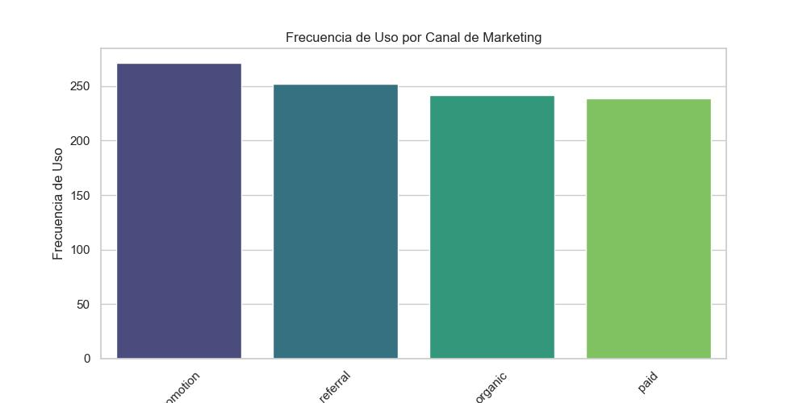
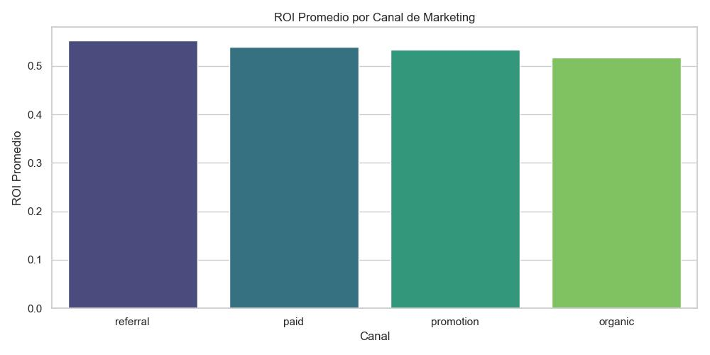

### ✅ 2.¿Qué tipo de campaña genera más ingresos en promedio y cuál tiene mejor conversión?

- **Social Media** con $529,591 es el tipo de campaña que genera más ingresos promedio.
- **Webinar** con 54.5% es el tipo de campaña con mejor tasa de conversión.

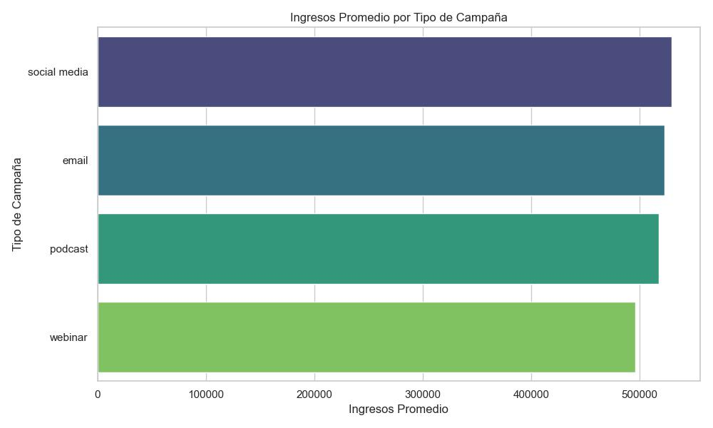
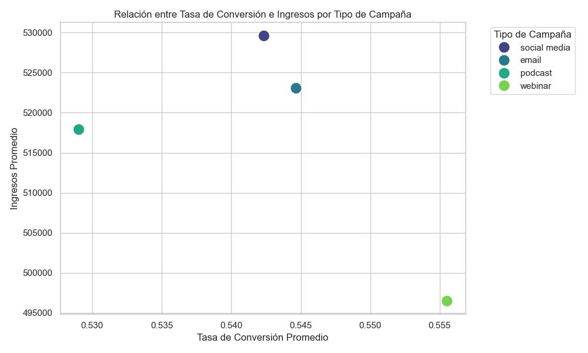

### ✅ 3.¿Cómo se distribuye el ROI entre las campañas? ¿Qué factores están asociados con un ROI alto??
-  Histograma: La mayoría de los valores de ROI se concentran entre 0.3 y 0.6, con una ligera asimetría a la derecha.
- El factor más correlacionado con ROI es la **tasa de conversión** (≈ 0.59).

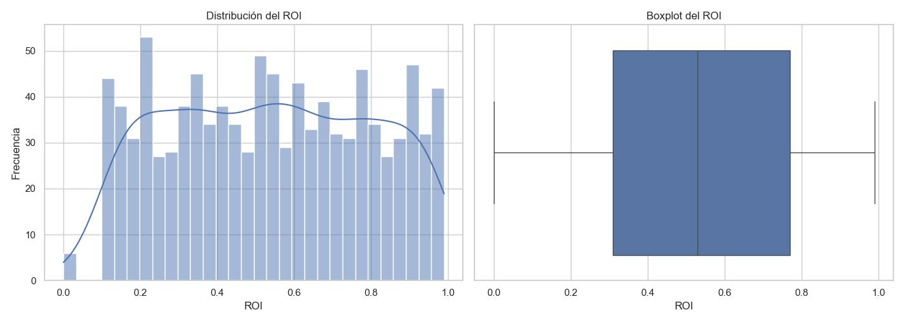

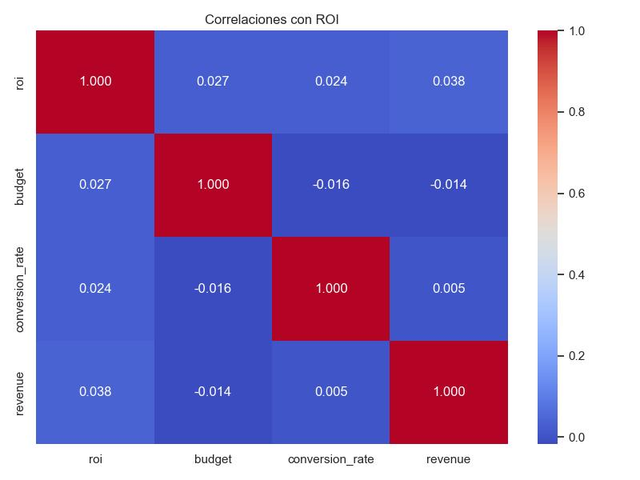

### ✅ 4. ¿Hay diferencia en conversión entre audiencias B2B y B2C?
- **No significativa** (p = 0.34)
- Ambas audiencias tienen tasas de conversión similares (≈ 0.54-0.55).

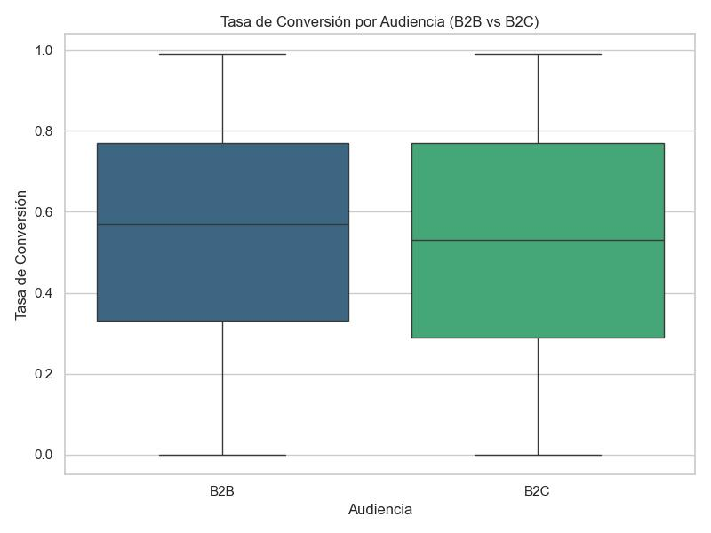
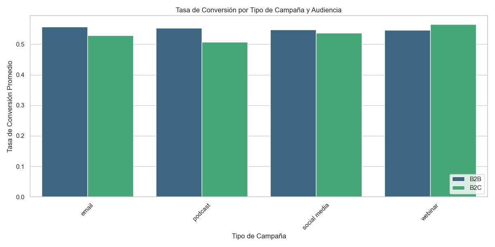

### ✅ 5. ¿Cuál es la campaña con mayor beneficio neto?¿Qué características la hacen exitosa?
- "**Advanced systematic complexity**" (Podcast, canal orgánico, B2C):
  - ROI: 0.95 | Conversion: 0.54 | Beneficio neto: > \$987K
- Características comunes en el top 5:
  - ROI alto, bajo presupuesto relativo, alto rendimiento.
  - Canales: Orgánico, Promoción, Referral.

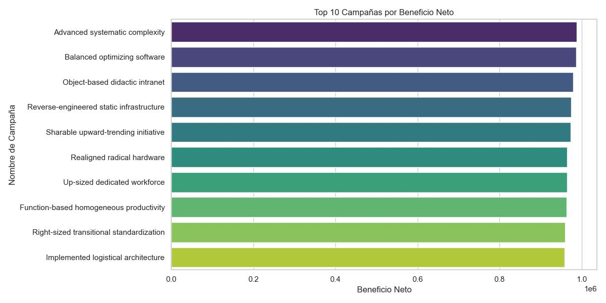

### ✅ 6. ¿Hay correlación entre presupuesto e ingresos?
- **No significativa**: Correlación = -0.01
- Se confirma que **invertir más no garantiza más ingresos**.

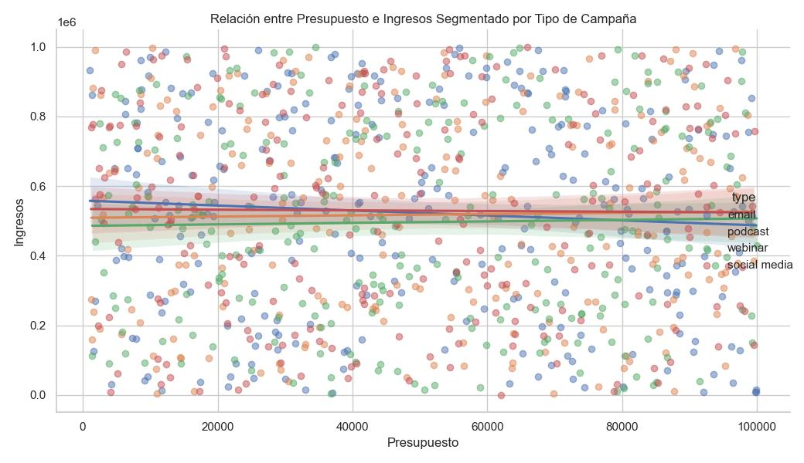

### ✅ 7. ¿Qué campañas tienen ROI > 0.5 e ingresos > \$500K?
- Varias campañas cumplen ambos criterios, destacando:
  - Canales: Promoción y Orgánico
  - Tipos: Podcast y Email
  - Conversiones > 0.65 y ROI > 0.6

  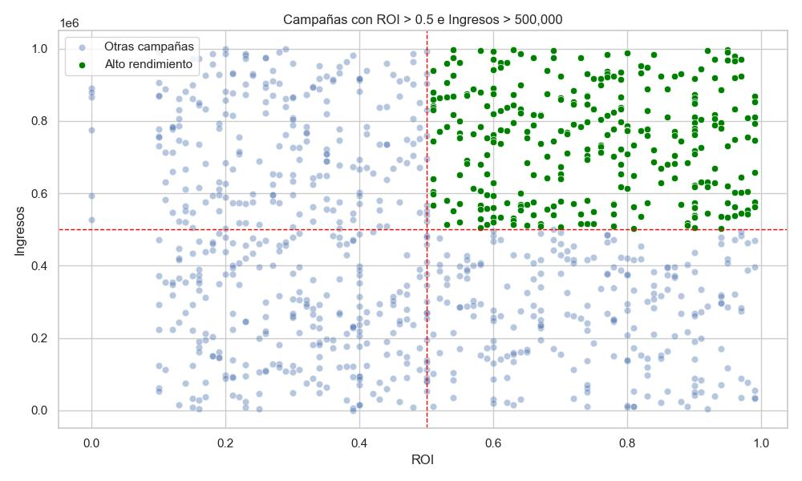

### ✅ 8. ¿Existen patrones estacionales o temporales?
- **ROI** y **ingresos** tienden a mejorar en **Q1 y Q2**.
- Algunas campañas (como Email y Podcast) muestran mejor rendimiento en meses específicos.
- Sugerencia: planificar lanzamientos clave entre abril-junio y octubre-diciembre.

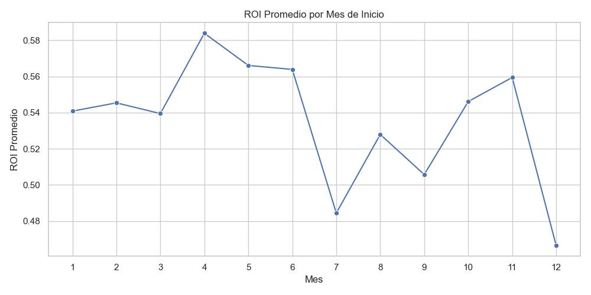
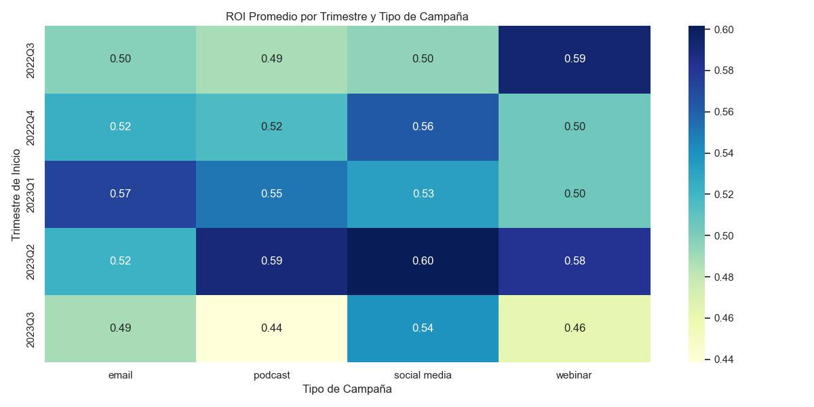
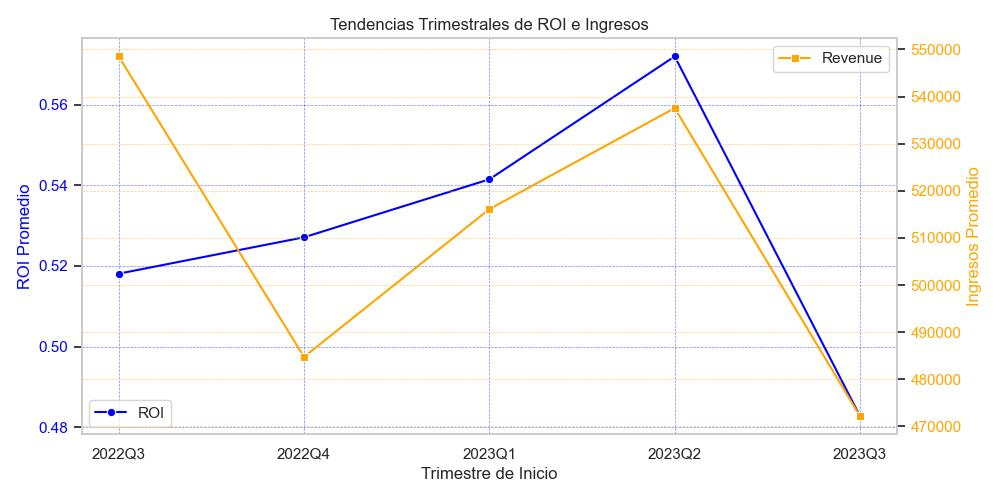

---

## 🔍 Conclusiones y Recomendaciones

### 🔹: Canal Promocional como Acelerador de ROI
- Las campañas con canal **"promotion"** lideran en ROI e ingresos combinados.
- Recomendado para nuevas campañas orientadas a conversiones rápidas.

### 🔹: Agendar Campañas por Temporada Alta
- Planificar campañas de alto impacto en los trimestres **Q2 (abr-jun)** y **Q4 (oct-dic)**, donde el rendimiento promedio es superior.

---

